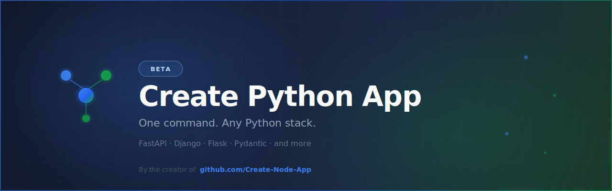

<div align="center">



# Create Python App

**One command. Any Python stack.** · Public **Beta**

> Composition-first scaffolding for Python — inspired by and built alongside [Create Node App](https://github.com/Create-Node-App).

[](https://pypi.org/project/create-awesome-python-app/)
[](https://create-awesome-python-app.vercel.app/)

</div>

---

## What is this?

`Create Python App` brings the composition-first scaffolding philosophy of [create-awesome-node-app](https://github.com/Create-Node-App/create-node-app) to the Python ecosystem.

Pick a template. Layer extensions. Ship production-ready Python projects in seconds — without spending hours on boilerplate configuration.

```bash
uvx create-awesome-python-app@latest my-api
```

Or pin a template for CI:

```bash
uvx create-awesome-python-app@latest my-api \
  --template fastapi-starter \
  --addons python-docker github-setup \
  --no-interactive
```

→ **[create-awesome-python-app.vercel.app](https://create-awesome-python-app.vercel.app/)**

---

## Repositories

| Repository | Description |
|---|---|
| [create-python-app](https://github.com/Create-Python-App/create-python-app) | CLI (`create-awesome-python-app`) + scaffolding engine |
| [cpa-templates](https://github.com/Create-Python-App/cpa-templates) | Official templates and extensions catalog |
| [website](https://github.com/Create-Python-App/website) | Docs + catalog at [create-awesome-python-app.vercel.app](https://create-awesome-python-app.vercel.app/) |
| [homebrew-tap](https://github.com/Create-Python-App/homebrew-tap) | Homebrew formula |
| [aur-package](https://github.com/Create-Python-App/aur-package) | AUR PKGBUILD mirror |

---

## Templates (Beta)

| Template | Stack |
|----------|-------|
| FastAPI Starter | FastAPI + uv + Ruff + pytest |
| CLI Starter | Typer/Click-ready CLI |
| Celery Worker | Background workers + Redis-ready |
| Django API | Django API starter |
| uv Workspace Starter | Multi-package uv monorepo |

→ [Browse templates](https://create-awesome-python-app.vercel.app/templates) · [Browse extensions](https://create-awesome-python-app.vercel.app/extensions)

---

## Status

Public **Beta**: the CLI, catalog, and website are live. APIs and templates may still evolve quickly — feedback welcome.

---

## Part of the Create Awesome App ecosystem

| Org | Stack | Status |
|-----|-------|--------|
| [Create-Node-App](https://github.com/Create-Node-App) | Node.js, TypeScript | ✅ Production |
| [Create-Python-App](https://github.com/Create-Python-App) | Python | 🧪 Beta |
| [Create-Vlang-App](https://github.com/Create-Vlang-App) | V language | 🔜 Planned |
