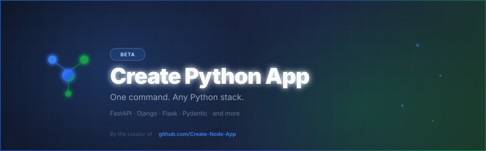

<div align="center">



# Create Python App

**One command. Any Python stack.**

> Composition-first scaffolding for Python, inspired by and built alongside [Create Node App](https://github.com/Create-Node-App).

[](https://pypi.org/project/create-awesome-python-app/)
[](https://pypi.org/project/create-awesome-python-app/)
[](https://create-awesome-python-app.vercel.app/)
[](https://discord.gg/bR5VyATgka)

</div>

---

## What is this?

`Create Python App` brings the composition-first scaffolding philosophy of [create-awesome-node-app](https://github.com/Create-Node-App/create-node-app) to the Python ecosystem.

Pick a template. Layer extensions. Ship production-ready Python projects in seconds without spending hours on boilerplate configuration.

```bash
uvx create-awesome-python-app@latest my-api
```

Or pin a template for CI:

```bash
uvx create-awesome-python-app@latest my-api \
  --template fastapi-starter \
  --addons fastapi-docker github-setup \
  --no-interactive
```

→ **[create-awesome-python-app.vercel.app](https://create-awesome-python-app.vercel.app/)**

---

## Community

Questions, ideas, template requests, and collaboration are welcome in the Create Awesome community.

[](https://discord.gg/bR5VyATgka)

---

## Contributing

New contributors are welcome. Start with a `good first issue` in any repo:

- [create-python-app](https://github.com/Create-Python-App/create-python-app/issues?q=is%3Aissue+is%3Aopen+label%3A%22good+first+issue%22) — CLI + scaffolding engine
- [cpa-templates](https://github.com/Create-Python-App/cpa-templates/issues?q=is%3Aissue+is%3Aopen+label%3A%22good+first+issue%22) — templates and extensions catalog
- [website](https://github.com/Create-Python-App/website/issues?q=is%3Aissue+is%3Aopen+label%3A%22good+first+issue%22) — docs and catalog site

Each repo has its own `CONTRIBUTING.md` with setup and expectations.

---

## Repositories

| Repository | Description |
|---|---|
| [create-python-app](https://github.com/Create-Python-App/create-python-app) | CLI (`create-awesome-python-app`) + scaffolding engine |
| [cpa-templates](https://github.com/Create-Python-App/cpa-templates) | Official templates and extensions catalog |
| [website](https://github.com/Create-Python-App/website) | Docs + catalog at [create-awesome-python-app.vercel.app](https://create-awesome-python-app.vercel.app/) |
| [homebrew-tap](https://github.com/Create-Python-App/homebrew-tap) | Homebrew formula |
| [aur-package](https://github.com/Create-Python-App/aur-package) | AUR PKGBUILD mirror |

---

## Templates

| Template | Stack |
|----------|-------|
| FastAPI Starter | FastAPI + uv + Ruff + pytest |
| CLI Starter | Typer/Click-ready CLI |
| Celery Worker | Background workers + Redis-ready |
| Django API | Django API starter |
| uv Workspace Starter | Multi-package uv monorepo |

→ [Browse templates](https://create-awesome-python-app.vercel.app/templates) · [Browse extensions](https://create-awesome-python-app.vercel.app/extensions)

---

## Status

The CLI, catalog, and website are live.

---

## Part of the Create Awesome App ecosystem

| Org | Stack | Status |
|-----|-------|--------|
| [Create-Node-App](https://github.com/Create-Node-App) | Node.js, TypeScript | ✅ Production |
| [Create-Python-App](https://github.com/Create-Python-App) | Python | ✅ Production |
| [Create-Vlang-App](https://github.com/Create-Vlang-App) | V language | ✅ Shipped (`0.1.0`) |
| [Create-Rust-App](https://github.com/Create-Rust-App) | Rust | 🔜 Soon |

---

## 👥 Contributors

### `create-python-app`: CLI & Scaffolding Engine

<a href="https://github.com/Create-Python-App/create-python-app/graphs/contributors">
  
</a>

### `cpa-templates`: Templates & Extensions Catalog

<a href="https://github.com/Create-Python-App/cpa-templates/graphs/contributors">
  
</a>

Made with [contrib.rocks](https://contrib.rocks).
